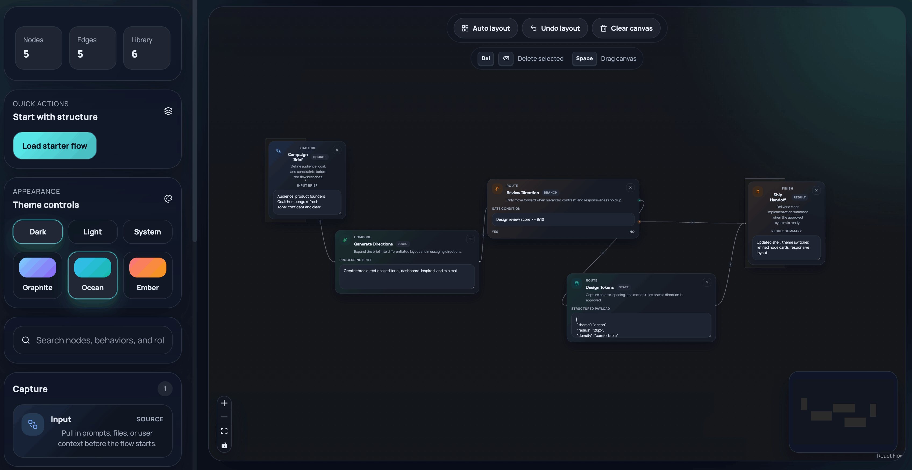

# React Flow Sidebar Template

A template for creating flow diagrams with a customizable sidebar using React Flow. Dark-themed interface with drag-and-drop node types.



## Features

- Dark/light mode with theme presets
- Customizable sidebar with node categories and search filtering
- Drag and drop nodes onto the canvas
- Multiple node types (Basic, Input, Output, Processing, Decision, Data)
- Deletable edges with hover controls
- Keyboard shortcuts
- Auto-layout via elkjs
- Zustand-based state management

## Tech Stack

- React 19 + TypeScript
- @xyflow/react v12
- Vite
- Tailwind CSS v4 (CSS-first config)
- Zustand (state management)
- elkjs (auto-layout)
- lucide-react (icons)

## Project Structure

```
reactflow-sidebar-template/
├── src/
│   ├── components/
│   │   ├── edges/
│   │   │   └── DeletableEdge.tsx
│   │   ├── nodes/
│   │   │   ├── BasicNode.tsx
│   │   │   ├── DataNode.tsx
│   │   │   ├── DecisionNode.tsx
│   │   │   ├── InputNode.tsx
│   │   │   ├── NodeFrame.tsx        # Shared node wrapper
│   │   │   ├── OutputNode.tsx
│   │   │   └── ProcessingNode.tsx
│   │   └── NodesSidebar.tsx
│   ├── hooks/
│   │   ├── useFlowDragDrop.ts       # Drag-and-drop logic
│   │   └── useFlowLayout.ts         # Auto-layout and starter flow
│   ├── lib/
│   │   ├── autoLayout.ts            # elkjs layout engine
│   │   ├── nodeCatalog.ts           # Node type registry
│   │   └── themeConfig.ts           # Theme modes and presets
│   ├── store/
│   │   └── flowStore.ts             # Zustand store
│   ├── styles/
│   │   ├── index.css                # Main entry, imports all modules
│   │   ├── base.css                 # CSS variables, theme presets
│   │   ├── app.css                  # App shell layout
│   │   ├── sidebar.css              # Sidebar and node library
│   │   ├── canvas.css               # Canvas topbar and controls
│   │   ├── nodes.css                # Custom node styling
│   │   ├── reactflow.css            # ReactFlow overrides
│   │   └── responsive.css           # Media query breakpoints
│   ├── App.tsx
│   ├── DarkModeProvider.tsx
│   └── main.tsx
├── eslint.config.mjs
├── index.html
├── package.json
├── tsconfig.json
└── vite.config.js
```

## Prerequisites

- [Bun](https://bun.sh) (version 1.0 or later)

## Getting Started

```bash
git clone https://github.com/whit3rabbit/reactflow-sidebar-template.git
cd reactflow-sidebar-template
bun install
bun dev
```

Open `http://localhost:5173` to view the application.

## Usage

- Use the sidebar to browse and search node types
- Drag and drop nodes onto the canvas
- Connect nodes by dragging from one handle to another
- Use the "Auto Layout" button to automatically arrange nodes
