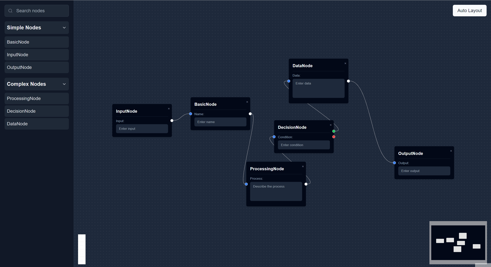

# React Flow Sidebar Template

This project is a template for creating flow diagrams with a customizable sidebar using React Flow. It provides a dark-themed interface with various node types that can be dragged and dropped onto the canvas.



## Features

- Dark-themed interface
- Customizable sidebar with node categories
- Drag and drop functionality for creating nodes
- Multiple node types (Basic, Input, Output, Processing, Decision, Data)
- Auto-layout functionality

## Project Structure

```
reactflow-sidebar-template/
├── public/
│   └── vite.svg
├── src/
│   ├── components/
│   │   ├── nodes/
│   │   │   ├── BasicNode.jsx
│   │   │   ├── DataNode.jsx
│   │   │   ├── DecisionNode.jsx
│   │   │   ├── InputNode.jsx
│   │   │   ├── OutputNode.jsx
│   │   │   └── ProcessingNode.jsx
│   │   ├── FlowCanvas.jsx
│   │   └── Sidebar.jsx
│   ├── styles/
│   │   └── global.css
│   │   └── index.css
│   ├── App.jsx
│   ├── DarkModeProvider.jsx
│   └── main.jsx
├── .eslintrc.cjs
├── .gitignore
├── index.html
├── package.json
├── README.md
├── screenshot.png
├── tailwind.config.js
└── vite.config.js
```

## Prerequisites

Before you begin, ensure you have met the following requirements:

- You have installed Node.js (version 14.0 or later recommended)
- You have installed Yarn package manager

## Installing and Running React Flow Sidebar Template

To install and run this project, follow these steps:

1. Clone the repository:
   ```
   git clone https://github.com/whit3rabbit/reactflow-sidebar-template.git
   ```

2. Navigate to the project directory:
   ```
   cd reactflow-sidebar-template
   ```

3. Install the dependencies:
   ```
   yarn install
   ```

4. Start the development server:
   ```
   yarn dev
   ```

5. Open your browser and visit `http://localhost:5173` to view the application.

## Using React Flow Sidebar Template

- Use the sidebar to select node types
- Drag and drop nodes onto the canvas
- Connect nodes by dragging from one handle to another
- Use the "Auto Layout" button to automatically arrange your nodes